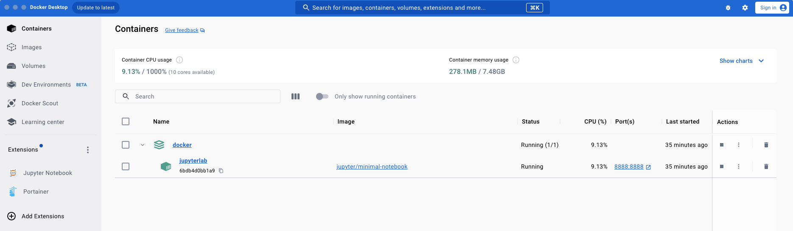
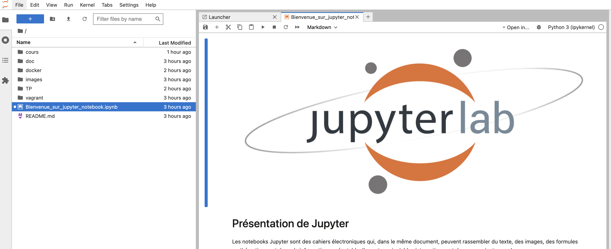

# PREPARATION DE VOTRE ENVIRONNEMENT POUR L'ANF "Vous avez dit NoSQL!" 

--- 
## Introduction 

Bienvenue à l'ANF " Vous avez dit NoSQL! "  dédié aux technologies de bases de données émergentes, connues sous le nom de NOSQL. Ce cours est conçu pour vous offrir une compréhension globale de l'évolution des bases de données, depuis les modèles traditionnels jusqu'à l'émergence et la popularité croissante de solutions NOSQL telles que MongoDB, Neo4J, Redis, Cassandra et bien d'autres ...

Nous débuterons par un aperçu historique pour comprendre comment les exigences de notre paysage numérique en constante évolution ont poussé à l'adoption de ces technologies avancées. Nous explorerons ensuite les défis relatifs aux performances, à la cohérence et à la disponibilité que les bases de données NOSQL s'efforcent de relever.

Au fil de la formation, nous examinerons les différentes approches des bases de données NOSQL, en discutant de leurs avantages et inconvénients. Vous aurez également l'opportunité de mettre en pratique vos connaissances en travaillant directement avec des solutions logicielles comme Neo4J, MongoDB, Cassandra et Redis.

En résumé, ce module vous offre une exploration du paysage des bases de données, depuis ses origines historiques jusqu'à ses applications comptemporaines. Vous ressortirez de cette formation, on l'expère ;-), avec une compréhension de la manière dont le NOSQL à contribuer au développement de notre informatique moderne.

Préparez-vous à bousculer vos aprioris sur les bases de données !

---

## OBJECTIFS PEDAGOGIQUES

* Mettre en place une solution NoSQL
* Évaluer les avantages et les inconvénients inhérents aux technologies NoSQL
* Analyser les principales solutions du monde NoSQL
* Identifier les champs d’application des BDD NoSQL


## 1 - Prérequis

Les travaux pratiques du module s'appuieront sur un environnement containerisé sous Docker.

Pour cette formation, vous devrez disposer d'un ordinateur ayant **au moins** les ressources suivantes :
- Plus de 4 Go de RAM
- Plus de 4 cœurs
- Plus de 10 Go d'espace disque libre

En termes de privilèges, vous devrez disposer des droits d'administrateur sur votre machine.

# Préparer son environnement de Travail 

Les travaux pratiques du module s'appuieront sur un environnement containerisé.
Toutes les applications que nous utiliserons feront parties du catalogue Docker Hub et nous détaillerons dans la suite de ce README les étapes à suivre :

* 1 - Prérequis matériel    
* 2 - Installer Docker Desktop
* 3 - Télécharger les images docker 


## 1 - Prérequis 

 Même si la containerisation à l'avantage d'être légère, les prérequis matériels pour suivre ce module sont les suivants :
* > 4Go de RAM
* > 4 cores
* > 10 Go d'espace disque libre

Vous devrez disposer d'un client git ou d'un IDE disposant des fonctionnalités git.

## 2 - Installation de Docker desktop

Docker fournit un logiciel Docker Desktop pour déployer très facilement et rapidement des applications par le biais d'images docker.
Vous pourrez télécharger Docker Desktop à l’url suivante :

https://www.docker.com/products/docker-desktop

---
**NOTE**

Pour les étudiants sous Windows, il sera nécessaire d'installer WSL 2. L'installation est longue et il faudra être patient. Si vous rencontrez des difficultés merci de contacter le tuteur.

---

Le tableau de bord ci-dessous s’affichera : 

---
**WARNING**

Si c'est la première fois que vous installez Docker Desktop le tableau des containers sera vide mais ne vous inquiétez pas c'est que temporaire.

---





Pour travailler avec docker on pourrait utiliser l'interface graphique fournie par Docker Desktop mais pour des raisons de facilité et de cohérence d'environnement il est fortement recommandé d'utiliser les invites de commande. 

Ouvrez un terminal ou un powershell si vous êtes sous Windows

---
**WARNING**

Si vous êtes sur Windows, ne confondez pas MSDOS et Powershell.

---

---
**WARNING**

Pour ceux qui sont sous Linux, vous n'êtes pas obligé d'installer Docker Desktop l'installation de Docker est suffisante toutefois il est probable que le plugin compose ne soit pas installé en même temps que docker.
Pour vérifier que le plugin compose est bien installé avec docker, exécutez dans un terminal la commande suivante :
`docker compose --help`

Si vous n'obtenez pas l'aide de `docker compose` alors vous devrez installer le plugin.
Le guide d'installation est par ici : https://docs.docker.com/compose/install/linux/

---

## 3 - Télécharger les images docker

Dans le répertoire de votre choix `$monrepertoire`, cloner le répertoire gitlab suivant :

ATTENTION, en cas d'échec, merci de bien vérifier l'url du dépôt lors du copier/coller des caractères spéciaux peuvent se glisser.  

```
cd $monrepertoire
git clone https://github.com/oaidel38090/anf_rbdd_nosql_092026.git
```


Positionner vous à présent dans le répertoire `anf_rbdd_nosql_092026/docker` puis télécharger l'ensemble des images docker nécessaire à la formation avec la commande suivante :

```
docker compose pull
```

L'ensemble des cours et TP sera disponible dans le répertoire git anf_rbdd_nosql_092026 lequel sera mis à jour au fur et à mesure des avancées.

Pour vérifier que votre environnement est opérationnel lancer la commande suivante :

```
cd $monrepertoire/anf_rbdd_nosql_092026/docker
docker compose up -d jupyterlab
```

Cette commande va lancer l'application jupyterlab sur votre ordinateur et sera accessible à l'url [http://127.0.0.1:8888/lab](http://127.0.0.1:8888/lab).
La page suivante devrait apparaitre :





Pour arrêter l'application jupyterlab, il vous suffit d'exécuter la commande suivante :

```
docker stop jupyterlab
```

Bravo, vous êtes à présent prêt à suivre le module.
